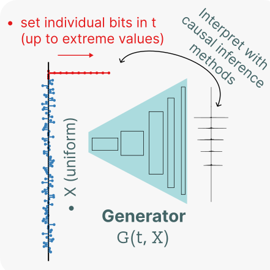

# Approaching an unknown communication system by latent space exploration and causal inference

[This repository](https://github.com/andleb/Approaching-an-unknown-communication-system) serves as the supplement of [the paper (preprint)](https://arxiv.org/abs/2303.10931), which uses generative models to help determine the meaningful building blocks of sperm whale communication.



**Abstract:**
> <p align="justify"> <i> This paper proposes a methodology for discovering meaningful properties in data by exploring the latent space of unsupervised deep generative models. We combine manipulation of individual latent variables to extreme values with methods inspired by causal inference into an approach we call causal disentanglement with extreme values (CDEV) and show that this method yields insights for model interpretability. With this, we can infer what properties of unknown data the model encodes as meaningful, using it to glean insight into the communication system of sperm whales (Physeter macrocephalus), one of the most intriguing and understudied animal communication systems. The network architecture used has been shown to learn meaningful representations of speech; here, it is used as a learning mechanism to decipher the properties of another vocal communication system in which case we have no ground truth. The proposed methodology suggests that sperm whales encode information using the number of clicks in a sequence, the regularity of their timing, and audio properties such as the spectral mean and the acoustic regularity of the sequences. Some of these findings are consistent with existing hypotheses, while others are proposed for the first time. We also argue that our models uncover rules that govern the structure of  units in the communication system and apply them while generating innovative data not shown during training. This paper suggests that an interpretation of the outputs of deep neural networks with causal inference methodology can be a viable strategy for approaching data about which little is known and presents another case of how deep learning can limit the hypothesis space. Finally, the proposed approach can be extended to arbitrary architectures and datasets.</i></p>


## Requirements

To install requirements for the model and the analysis, run:

```shell
pip install -r requirements.txt
```


## The `fiwGAN` model

The `fiwGAN` architecture implementation in `pytorch` is located in [ciwfiwgan](ciwfiwgan) ([original fork repository](https://github.com/andleb/ciwganfiwgan-pytorch)).

The command-line parameters were the following:

```shell
python train.py --fiw --num_categ 5 --datadir training_directory --logdir log_directory\
--num_epochs 15000 --slice_len 65536
```

The remaining hyperparameters were the model defaults set [here](https://github.com/andleb/Approaching-an-unknown-communication-system/blob/bbd881847dc7264ffc5665d03a960363ad14cb55/ciwfiwgan/train.py#LL98C5-L98C5) and [here](https://github.com/andleb/Approaching-an-unknown-communication-system/blob/bbd881847dc7264ffc5665d03a960363ad14cb55/ciwfiwgan/train.py#LL135C5-L135C5).


### The training data


Unfortunately, the raw audio training data is not free to share. It based on of hours of continuous recordings by whale-born tags, which were then annotated with the positions of actual codas. These annotations were then used to extract the training data.

The training data thus consisted of 2209 *coda* samples of less than 2s in length, encoded in 32 kHZ mono `wav` format.
In terms of data preprocessing, a constant DC microphone bias was removed from the extracted recordings, which were then augmented by random zero-padding in the front to address the fact that all the extracted codas would otherwise have a click at the very beginning.


### Trained Model

Instead of the data, we thus provide the generator component of main trained model used to
generate results [here](https://github.com/andleb/Approaching-an-unknown-communication-system/releases/download/model/model.pt).

Additionally, we provide a separate, independently trained model for robustness checks (see below) [here](https://github.com/andleb/Approaching-an-unknown-communication-system/releases/download/replication_model/model-6cat.pt).

The models can be loaded with the following snippet after putting [ciwfiwgan](ciwfiwgan) on your path
(all following code also assumes the module is on the path):

```python
import torch
from infowavegan import WaveGANGenerator

device = torch.device("cuda" if torch.cuda.is_available() else "cpu")

G = WaveGANGenerator(slice_len=2**16)
G.load_state_dict(torch.load("model.pt", map_location=device))
G.to(device)
```

### Compute resources used for model training


The model was trained across approximately 3 days on a single Nvidia 1080Ti (11 GB GPU memory) on a cluster-based instance running on Intel Xeon E5-2623.


## Analysis


### The click detector

The [click detector module](https://github.com/andleb/Approaching-an-unknown-communication-system/blob/main/clickDetector.py)
outputs the *inter-click intervals* (ICIs) and the overall number of clicks in the provided generated raw audio sample.
It uses some signal filtering and minimal thresholds for both the amplitude and the temporal separation,
both based on our prior knowledge of whale communication.


### Data generation

The data generation for the experiments based on the number of clicks and the inter-click intervals (ICIs) is performed
by running the [dataGenClick](https://github.com/andleb/Approaching-an-unknown-communication-system/blob/main/dataGenClick.py)
script with the path to the [trained model](https://github.com/andleb/Approaching-an-unknown-communication-system/releases/download/submission/model.pt) as a
command-line parameter.

The data generation for the experiments based on the audio properties is performed
by running the [dataGenAudio](https://github.com/andleb/Approaching-an-unknown-communication-system/blob/main/dataGenAudio.py)
script with the same command-line parameter.


### Analysis notebooks

For convenience, the raw outputs of the data generation above are provided in [data/](https://github.com/andleb/Approaching-an-unknown-communication-system/tree/main/data).

- [nClicks.ipynb](https://github.com/andleb/Approaching-an-unknown-communication-system/blob/main/nClicks.ipynb) replicates the
  results for the _number of clicks_.

- [ICI.ipynb](https://github.com/andleb/Approaching-an-unknown-communication-system/blob/main/ICI.ipynb) replicates the
  results for the *click spacing and regularity*.

- [acoustic.ipynb](https://github.com/andleb/Approaching-an-unknown-communication-system/blob/main/acoustic.ipynb)
  replicates the results for the *acoustic properties*.
  Note that since these results were obtained from an independently sampled $X$, a replication of the
  result for the number of clicks is included in the notebook as a means of checking the validity of the preceding results.


## Robustness check
A quick replication of the number of clicks encoding result using an independently trained model with a different number
of specified encodings is provided in `robustness.ipynb`.


### Compute resources used for data generation and analysis

The data generation and calculation of the quantities of interest was done in parallel on four Nvidia T4 GPUs
on an `g4dn.12xlarge` AWS instance, taking about a day for each of the two outcome types presented: click number and spacing,
and audio properties.

The analysis of those outcomes and the generation of the results was then performed locally.

## Citations

If you use this repository in your research, please refer to the [citation file](https://github.com/andleb/Approaching-an-unknown-communication-system/blob/main/CITATION.cff)
(for the code) and [the paper](https://arxiv.org/abs/2303.10931) in general.

## License

All content in this repository is licensed under the [BSD 3-Clause License](LICENSE).  
Andrej Leban


